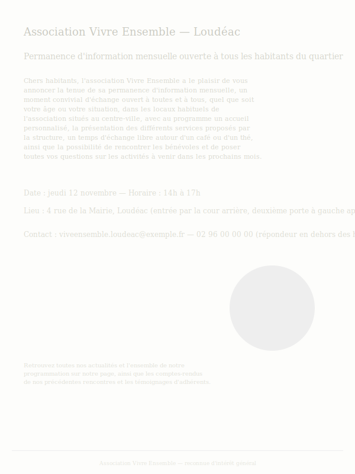
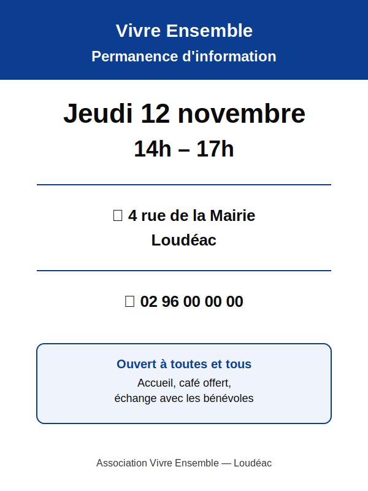

# ♿ Une affiche que tout le monde peut lire

  :material-certificate-outline: Compétences Pix
  CRCN 3.3

2nde Bac Pro SAPAT — EG4 · Vivre et agir ensemble

Créer un contenu numérique accessible pour une association du territoire

  :material-clock-outline: 50 min (40 min effectives)
  :material-school-outline: EG4 — Vivre et agir ensemble

## Mise en situation

L'association locale **« Vivre Ensemble »** de Loudéac organise une permanence d'information ouverte à tous les
habitants du quartier, y compris des personnes malvoyantes, malentendantes ou peu à l'aise avec la lecture. La
présidente de l'association te demande de préparer une affiche numérique annonçant la permanence — mais elle a
remarqué que la dernière affiche, envoyée à d'autres associations partenaires, comportait du texte trop petit et
peu contrasté, illisible pour certains adhérents âgés.

**Ton rôle :** créer une affiche numérique qui informe clairement ET qui reste lisible et compréhensible par le
plus grand nombre — c'est ce qu'on appelle l'**accessibilité numérique**.

!!! question "Problématique"
    « Comment créer une affiche numérique qui informe efficacement tout en restant accessible à des personnes
    ayant des difficultés de vue, d'audition ou de lecture ? »

## Objectifs

- Identifier les principaux obstacles à l'accessibilité d'un contenu numérique
- Appliquer des règles simples d'accessibilité (contraste, taille de police, texte alternatif) à une production réelle
- Créer un contenu numérique responsable, adapté à un public varié

## Travail à faire

**Comprendre l'accessibilité, puis créer l'affiche**

1. Observer les deux affiches ci-dessous (une accessible, une non accessible — même annonce, deux traitements différents) et lister 3 différences visibles (taille du texte, contraste des couleurs, quantité d'informations).

    !!! example "Affiche A — non accessible"
        { width="320" }

    !!! example "Affiche B — accessible"
        { width="320" }
2. Rechercher la règle du **contraste minimum** recommandée pour un texte lisible (recherche : « contraste texte fond accessibilité numérique ») et la noter avec sa source.
3. Créer l'affiche dans l'outil de ton choix (Canva, PowerPoint, Google Slides) en respectant au minimum : texte en gros caractères (titre et informations essentielles lisibles à 2 mètres), fort contraste entre texte et fond, phrases courtes et vocabulaire simple, pas plus de 3 informations essentielles sur l'affiche (date, lieu, contact).
4. Ajouter un **texte alternatif** décrivant l'image principale de l'affiche (clic droit sur l'image → texte de remplacement), utile pour les lecteurs d'écran.
5. Faire relire l'affiche par un camarade : lui demander s'il comprend l'information en moins de 5 secondes de lecture.

!!! tip "Astuce"
    Si tu hésites entre deux couleurs de texte sur un fond, choisis toujours la plus contrastée (ex. texte noir ou blanc plutôt que gris clair sur fond clair).

**Questions de synthèse**

- Cite 2 règles d'accessibilité que tu as appliquées sur ton affiche.
- Pourquoi une affiche accessible profite-t-elle à tout le monde, pas seulement aux personnes en situation de handicap ?

!!! tip "Où répondre ?"
    Dépose ton affiche (export image ou PDF) et tes réponses dans ton bloc-notes **OneNote**, section
    *EG4 — Vivre et agir ensemble*.

## Ressources et outils

- [Canva](https://www.canva.com){ target="_blank" rel="noopener" } — création de l'affiche, modèles accessibles disponibles.
- **Recherche recommandée** : « règles accessibilité numérique contraste police » — pour trouver une source institutionnelle (ex. RGAA, Réseau national de ressources en accessibilité numérique).

## Grille d'évaluation

| Critère | Indicateur de réussite |
|---|---|
| Compréhension de l'accessibilité | Les différences entre affiche accessible/non accessible sont identifiées et justifiées. |
| Application des règles | Contraste, taille de texte, texte alternatif et sobriété du contenu sont respectés sur la production finale. |
| Production | L'affiche est complète, exportée, lisible en moins de 5 secondes par un tiers. |
| Usage responsable de l'IA | IA non utilisée sur cette activité (production graphique manuelle). |

!!! note "Compétences visées"
    EG4 — attendu 1 (environnement numérique, accessibilité) et attendu 2 (création de contenus numériques
    universels et responsables). CRCN 3.3 (adapter un document à son public et à sa finalité, dont l'accessibilité —
    le domaine CRCN 5 s'arrête à 5.2, il n'existe pas de 5.3).
