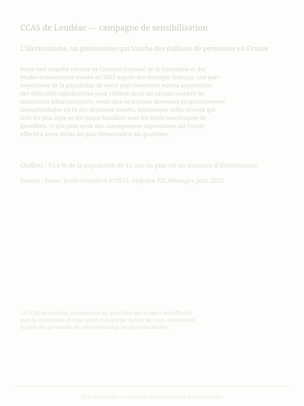
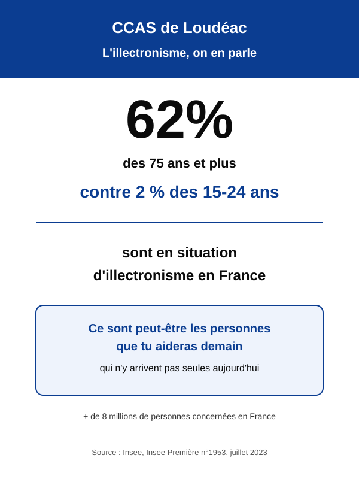

# ♿ Une affiche accessible contre l'illectronisme

  :material-certificate-outline: Compétences Pix
  CRCN 3.3
  CRCN 2.4

2nde Bac Pro SAPAT — EG4 · Vivre et agir ensemble

Sensibiliser des jeunes à l'illectronisme avec des chiffres réels, sur une affiche qui applique elle-même les règles d'accessibilité qu'elle défend

  :material-clock-outline: 50 min (40 min effectives)
  :material-school-outline: EG4 — Vivre et agir ensemble
  :material-tag-outline: Canva · RGAA

## Mise en situation

Le **CCAS de Loudéac** constate, sur le terrain, que de nombreux usagers accompagnés par ses services (aide à
domicile, EHPAD, accueil social) ne parviennent plus à réaliser seuls des démarches devenues presque entièrement
numériques : renouveler des droits sur caf.fr, prendre un rendez-vous médical sur Doctolib, déclarer ses revenus sur
impots.gouv.fr. Ce phénomène a un nom : l'**illectronisme**. Selon l'Insee, en 2021, **15,4 %** de la population
française de 15 ans ou plus est en situation d'illectronisme — **13,9 %** n'ont pas utilisé Internet au cours des
trois derniers mois et **1,5 %** l'ont utilisé sans disposer des compétences numériques de base — et l'écart
est massif entre générations : **62 %** des personnes de 75 ans ou plus sont concernées, contre seulement **2 %**
des 15-24 ans (source : Insee, *Insee Première* n°1953, juin 2023).

Pour que les jeunes du territoire mesurent cet enjeu avant même d'entrer dans les métiers de l'aide et du soin, le
CCAS lance une campagne d'affichage dans les lieux qu'ils fréquentent : CDI du lycée, foyer socio-éducatif,
structures jeunesse locales.

**Ton rôle :** tu es agent de médiation numérique au CCAS de Loudéac. **Mme Le Goff**, responsable de l'action
sociale, te confie la création d'une affiche de sensibilisation destinée aux jeunes : elle doit leur faire
comprendre, chiffres réels à l'appui, que des usagers qu'ils accompagneront demain restent exclus du numérique — et
l'affiche doit elle-même être un exemple d'accessibilité, pas seulement en parler.

!!! question "Problématique"
    « Comment sensibiliser des jeunes à la réalité de l'illectronisme en France et dans le secteur SAPAT, avec une
    affiche qui applique elle-même les règles d'accessibilité qu'elle défend ? »

## Objectifs

- Rechercher et citer une donnée chiffrée réelle et sourcée sur l'illectronisme en France
- Rédiger un message de sensibilisation clair et impactant, destiné à un public de jeunes, sur les enjeux de
  l'illectronisme dans le secteur SAPAT
- Appliquer au moins 5 règles d'accessibilité (contraste, police, pictogrammes, sobriété du texte, hiérarchie
  visuelle) pour que l'affiche illustre elle-même sa propre leçon

## Travail à faire

### A — Rechercher un chiffre réel et comprendre l'enjeu SAPAT

**Prélever une donnée chiffrée fiable et la relier au secteur**

1. Ouvrir la fiche [Insee Première n°1953 — 15 % de la population est en situation d'illectronisme en 2021](https://www.insee.fr/fr/statistiques/7633654){ target="_blank" rel="noopener" } et relever dans OneNote le taux
   national d'illectronisme et sa décomposition (part des personnes n'ayant pas utilisé Internet récemment / part
   l'ayant utilisé sans disposer des compétences numériques de base).
2. Relever, dans la même étude, l'écart générationnel (comparaison du taux d'illectronisme des personnes les plus
   âgées et des plus jeunes) et noter la source exacte (Insee, *Insee Première* n°1953, juin 2023).
3. Ouvrir la fiche [L'illectronisme en chiffres](https://www.anlci.gouv.fr/illectronisme/lillectronisme-en-chiffres/){ target="_blank" rel="noopener" } de l'ANLCI (Agence nationale de lutte contre l'illettrisme) et relever la
   définition de l'illectronisme en une phrase.
4. Lister 3 démarches numériques devenues incontournables pour un usager SAPAT (ex. Doctolib pour un rendez-vous
   médical, caf.fr pour une allocation, impots.gouv.fr pour une déclaration) et, pour chacune, une conséquence
   concrète si la personne ne peut pas l'accomplir seule.

!!! tip "🆘 Coup de pouce"
    Si les chiffres se mélangent, retiens seulement ces deux données pour l'affiche : **15,4 %** (part de la
    population de 15 ans ou plus en situation d'illectronisme) et **62 % contre 2 %** (écart entre les 75 ans et
    plus et les 15-24 ans). Ce sont les deux chiffres les plus parlants pour un public jeune.

### B — Cadrer le message pour un public de jeunes

**Choisir un angle, un chiffre et un ton**

1. Formuler en une phrase le message unique de l'affiche, destiné à des jeunes (ex. « Ce sont peut-être les
   personnes que tu aideras demain qui n'y arrivent pas seules aujourd'hui »).
2. Choisir, parmi les chiffres relevés en A, **un seul** chiffre à mettre en avant visuellement — celui qui a le
   plus d'impact sur un jeune (l'écart générationnel 62 %/2 % est en général plus parlant qu'un pourcentage isolé).
3. Identifier le lieu d'affichage réel visé (CDI du lycée, foyer socio-éducatif, structure jeunesse locale) et en
   déduire deux contraintes concrètes (affiche lue debout, en quelques secondes, souvent à plusieurs mètres).
4. Rédiger le texte complet de l'affiche en 3 blocs maximum : le chiffre choisi, la phrase-message, la mention de la
   source.

!!! tip "Astuce"
    Une affiche de sensibilisation qui cite un chiffre sans sa source perd toute crédibilité auprès d'un public
    averti — la source doit rester visible, même en petits caractères, jamais absente.

### C — Créer l'affiche accessible (elle applique sa propre leçon)

**Produire une affiche qui illustre elle-même l'accessibilité**

1. Ouvrir [Canva](https://www.canva.com){ target="_blank" rel="noopener" } et choisir un format affiche (A4 ou A3,
   portrait).
2. Appliquer au minimum 5 règles d'accessibilité tirées du [RGAA — Référentiel général d'amélioration de l'accessibilité](https://accessibilite.numerique.gouv.fr/){ target="_blank" rel="noopener" } : contraste fort entre
   texte et fond, police sans-serif lisible à 2 mètres pour le titre et le chiffre, pictogrammes simples plutôt que
   texte long, pas plus de 3 blocs d'information, hiérarchie visuelle claire (le chiffre choisi doit être l'élément
   le plus visible de l'affiche).
3. Intégrer le chiffre choisi en très grand format, la phrase-message en dessous, et la source en petits caractères
   en pied d'affiche.
4. Exporter l'affiche en image ou PDF et ajouter un **texte alternatif** décrivant son contenu (utile pour un
   lecteur d'écran si elle est aussi publiée en ligne).
5. Faire relire l'affiche par un camarade : lui demander de reformuler le message et de retenir le chiffre en moins
   de 5 secondes de lecture.

!!! success "⭐ Pour aller plus loin"
    Compare ton affiche aux deux exemples ci-dessous (une version non accessible, une version accessible, sur ce
    même sujet de l'illectronisme) et note en 3 lignes ce que la version accessible fait de différent — au-delà du
    contraste, regarde la quantité de texte et la hiérarchie de l'information.

    !!! example "Affiche A — non accessible"
        { width="320" }

    !!! example "Affiche B — accessible"
        { width="320" }

### Questions de synthèse

- Quel est le taux national d'illectronisme en France en 2021, et comment se décompose-t-il ?
- Quel écart générationnel les mêmes données Insee mettent-elles en évidence ?
- Cite 2 règles d'accessibilité que tu as appliquées sur ton affiche, et explique en une phrase pourquoi une affiche
  accessible profite à tout le monde, pas seulement aux personnes en difficulté avec le numérique.

??? tip "Vérifier mes réponses"
    - 15,4 %, dont 13,9 % de personnes n'ayant pas utilisé Internet au cours des trois derniers mois et 1,5 % l'ayant
      utilisé sans disposer des compétences numériques de base (Insee, 2023).
    - 62 % des 75 ans ou plus en situation d'illectronisme, contre 2 % des 15-24 ans.
    - Réponse libre : toute règle d'accessibilité réellement appliquée sur l'affiche, avec une justification
      cohérente sur le bénéfice pour tous les publics.

!!! tip "Où répondre ?"
    Dépose ton affiche (export image ou PDF) et tes réponses dans ton bloc-notes **OneNote**, section
    *EG4 — Vivre et agir ensemble*.

## Ressources et outils

- **Insee — Insee Première n°1953 (juin 2023)** : chiffre national et écart générationnel sur l'illectronisme,
  source à citer sur l'affiche — [insee.fr/fr/statistiques/7633654](https://www.insee.fr/fr/statistiques/7633654){ target="_blank" rel="noopener" }.
- **ANLCI — L'illectronisme en chiffres** : définition et données complémentaires (Agence nationale de lutte contre
  l'illettrisme) — [anlci.gouv.fr](https://www.anlci.gouv.fr/illectronisme/lillectronisme-en-chiffres/){ target="_blank" rel="noopener" }.
- **RGAA — Référentiel général d'amélioration de l'accessibilité** : méthode et critères officiels d'accessibilité
  numérique (DINUM) — [accessibilite.numerique.gouv.fr](https://accessibilite.numerique.gouv.fr/){ target="_blank" rel="noopener" }.
- **Canva** : création de l'affiche, modèles accessibles disponibles — [canva.com](https://www.canva.com){ target="_blank" rel="noopener" }.

## Grille d'évaluation CRCN 3.3 / 2.4 — Sensibilisation et accessibilité numérique

**Production attendue :** une affiche de sensibilisation à l'illectronisme, exportée en image ou PDF, destinée à
l'affichage pour les jeunes du territoire par le CCAS de Loudéac (Mme Le Goff).

| Critère | Indicateurs observables | Niveau |
|---|---|---|
| Donnée chiffrée | Chiffre réel relevé, exact, et source citée précisément sur l'affiche | -- / - / + / ++ |
| Message pour les jeunes | Message unique, ton et angle adaptés à un public de jeunes, lien SAPAT explicite | -- / - / + / ++ |
| Règles d'accessibilité | Au moins 5 règles appliquées (contraste, police, pictogrammes, sobriété, hiérarchie visuelle) | -- / - / + / ++ |
| Production | Affiche complète, exportée, message et chiffre retenus en moins de 5 secondes par un tiers | -- / - / + / ++ |
